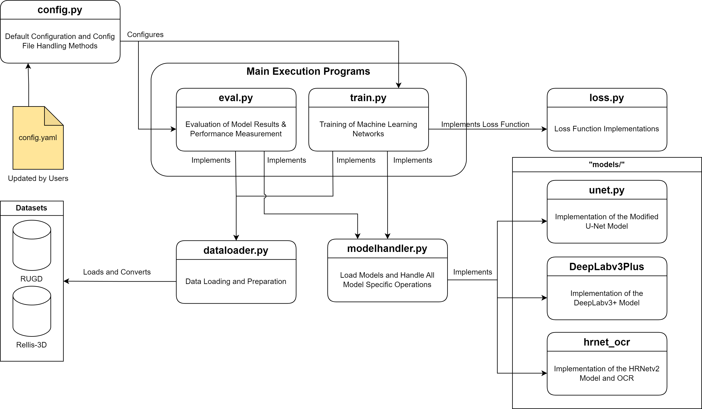

<div align="justify">

# Vision based Terrain Classification (VBTC) EMSLab Research Repository
This repository contains the code for the implementation of Vision-based Terrain Classification Research as part of the Embedded Multi-Sensor Resarch Laboratory at Carleton University (Ottawa, ON). As a research repository, the code relevant to several aspects are included within this repository.
Installation instructions for required software solutions and enviroment information is provided in the following sections of the README.MD. We additionally include the implementation instructions for our FCIoU paper below which can be used to recreate the comparative study and experiments detailed in the research manuscript.  

#### Publications
Plangger, Jonathan, Mohamed Atia, and Hicham Chaoui. “FCIoU: A Targeted Approach for Improving Minority Class Detection in Semantic Segmentation Systems.” Machine Learning and Knowledge Extraction 5, no. 4 (November 23, 2023): 1746–59. https://doi.org/10.3390/make5040085.


### Repository Structure
The structure of the repository code is represented as: 



### FCIoU: A Focal Class-based Intersection over Union (IoU) Approach to Improving Minority Class Detection Performance for Off-road Segmentation Systems
## Abstract
In this paper, we present a comparative study of modern semantic segmentation loss functions and their resultant impact when applied with state-of-the-art off-road datasets. Class imbalance, inherent in these datasets, presents a significant challenge to off-road terrain semantic segmentation systems. With numerous environment classes being extremely sparse and underrepresented, model training becomes inefficient and struggles to comprehend the infrequent minority
classes. As a solution to this problem, loss functions have been configured to take class imbalance
into account and counteract this issue. To this end, we present a novel loss function, Focal Classbased Intersection over Union (FCIoU), which directly targets performance imbalance through the
optimization of class-based Intersection over Union (IoU). The new loss function results in a general
increase in class-based performance when compared to state-of-the-art targeted loss functions. 

### Getting Started 
#### Environment Setup & Installation
**Python** ver. **3.8.15**, **Pytorch** ver. **1.13.1+cu117**, & **TorchVision** ver. **0.14.1+cu117** were employed during development. Other, more recent versions of these may operate correctly, however only the specified versions were tested. 

Other libraries employed are defined within the *requirements.txt* file included in this repository. Project dependencies can be installed directly through:
```
pip install -r requirements.txt
```

##### Running the program
Once all the dependencies are installed and resolved, the code can be started by directly running the eval.py and train.py code. The specific configurations by these programs can be configured using the config/config_comparative_study.yaml.


### Loss Functions
Loss function implementations employed within the study are defined in *loss.py*. Each loss function were recreated within this study to suit the task of multi-class segmentation. Further information regarding the specific loss functions are provided within the paper manuscript. 

Selection of loss function for training can be configured through the *CRITERION* field in the *config_comparative_study.yaml* file in the *configs* directory. The possible selections are as follows: 
<i>
- fciouv1 -> fciouv6 (V1 and V2 are Featured within the manuscript)
- dicefocal
- diceloss
- dicetopk
- iouloss
- powerjaccard
- tverskyloss
- focalloss
</i>

Selecting a specific loss function in the *CRITERION* field results in the use of the corresponding loss function class. 
</div>

### Models for Comparative Study
Contained within the models/ directory is a selection of state-of-the-art semantic segmentation modeles employed in the comparative study. The original implementations of the models were obtained from: 

HRNetv2 + OCR: https://github.com/HRNet/HRNet-Semantic-Segmentation
DeepLabv3+: https://github.com/VainF/DeepLabV3Plus-Pytorch
U-Net: https://amaarora.github.io/posts/2020-09-13-unet.html


#### Model Configuration
The configuration for the model utilized in training or evaluation can be selected and modified through the *MODEL_NAME* field in the configuration file. 

The strings to select each of the specified model are as follows: 
- *fciouvX*, where *X* refers to the desired version (fciouv1,etc.)
- *deeplabv3plus*,  Deeplabv3+
- *hrnet_ocr*, HRNetv2 & OCR


